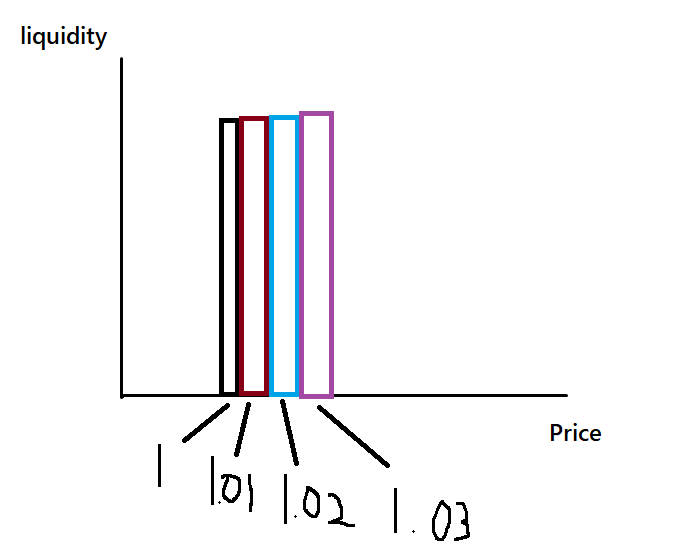

# Klaberos swap

This project is a concentrated amm based on [Trader Joe's liquidity book](https://docs.lfj.gg/).
For those unfamiliar, liquidity book was the inspiration behind [Meteora's DLMM](https://docs.meteora.ag/product-overview/meteora-liquidity-pools/dlmm-overview/what-is-dlmm)

## The Problem

Most Dexes on Soroban are based on the Uniswap v2 model. As I see it, this has a few issues:
- Large swaps are not as efficient due to slippage
- It is hard for a liquidity provider to manage their risk. I believe this can limit how much liquidity someone would be willing to provide.

## Klaberos swap high-level overview

Klaberos swap is a concentraded AMM based on [Trader Joe's liquidity book](https://docs.lfj.gg/)

A quick high-level explanation of the basic concepts
- **Bin** - Liquidity is divided up in bins. 
  - Each bin contains liquidity that is separate from the other bins.
  - The price in each bin is constant. The price is calculated by the bin id.
  - The prices in each bin are spaced by some percentage. For example, in bin 0, the price would be 1 and in bin
1, the price would increase by 0.10% and be 1.001.
  - Each bin is like a vault. Each bin has their own shares that needs to be tracked to deal with deposits and withdrawals.

- **Position** - A Position is a collection if bin shares received when depositing. It is used to track the deposits of a user.
    - Each Position is keyed by a user address and a position id. So each user can have multiple positions.
- **Providing Liquidity** - To provide liquidity you specify a position id, the bins in which you want to deposit and the amounts for each.
  - Liquidity will then be provided in the bins and the shares received will be credited to the bin.

- **Active Bin** - The active bin is the bin at the current price.
  - This is the bin where swaps will start.
  - Only the active bin has liquidity of both tokens.

- **Swapping** - Swapping is more complicated compared to Uniswap v2.
  - The swap will start at the active bin and move left or right depending on the asset being sold.
  - It will trade against each applicable bin until all the input tokens are exhausted.


> The image shows an paint drawing of the bins. in the picture there are 4 bins, each have a different price. That means that all of the trades within that bin will
happen at that price, until one side of the liquidity is exhausted and then we go to then next bin.


### How does this solve the problem?
> Large swaps are not as efficient due to slippage

Liquidity providers can concentrate their liquidity near the current price, improving swap efficiency. Though to be fair, this is not a guarantee. It also mak
providing liquidity complex.


> It is hard for a liquidity provider to manage their risk. I believe this can limit how much liquidity someone would be willing to provide.

Liquidity providers can choose at which prices to provide liquidity and how much liquidity to provide at the different prices.
They can also adjust the liquidity distribution based on recent changes in the market.

## Architecture
This is pretty simple. There is the contract and the frontend. 
The frontend uses generated contract bindings to interact with the contract via the Stellar rpc.

## Implementation details

Let's talk about two things. Modifying positions and swapping. The functions of the contracts are getters.

### General
Before I spoke about bins. The bins are stored in a lists of size `BIN_VEC_SIZE`, which is currently 75.
Each vec has an id and holds a number of bins. the vec with id `0` holds bins with id `0` to `BIN_VEC_SIZE` and so on.

The same is done for storing the total shares of each bin. 

In the code, this is referred to as `shares_vec` and `bin_vec`.

> **NOTE**: The Bins are stored this way because a swap or deposit might need to access many bins, and LedgerKeys are expensive.


```rust
#[contracttype]
pub struct Bin {
    pub bin_id: i32,
    pub reserve_x: i128,
    pub reserve_y: i128,
}

#[contracttype]
pub struct BinShares {
    pub bin_id: i32,
    pub shares: i128,
}
```
> This is the external representation of the bin and bin shares that we use in the contract api. Under the hood we use a different representation.

As mentioned, before bins/bin shares are stored in vecs to save on the cost of LedgerKeys. However, this means that we store and access a lot of data.
The `contracttype` macro generates `from_val` and `to_val` implementations that use maps under the hood. Maps have a lot of overhead, because the struct field names are also stored.

Instead, I wrote function that store the Bin as `Vec<i128>` and BinShares as `i128`. Remember that we access the bins by a vec_id, so we can use that to derive
the `bin_id`. And only for the active bin do we need to store both reserves. So all of the bins except for the active one is stored a `Vec<i128>` of size 1 and only 
the active bin has a second element.

```rust
pub fn bin_to_vec(env: &Env, bin: &Bin) -> Vec<i128>{
    if bin.reserve_x > 0 && bin.reserve_y > 0 {
        Vec::from_array(&env, [bin.reserve_x, bin.reserve_y])
    }else{
        let reserve = if bin.reserve_x > 0 {bin.reserve_x} else {bin.reserve_y};
        Vec::from_array(&env, [reserve])
    }
}
```
> Here is the function to convert the Bin to an Vec<128> as an example.


> **NOTE** - Storing the bins like this caused the tx fees for swap to go from ~0.04XLM to ~0.025XLM. Though that was on testnet.

### Security
- I always round in the benefit of the contract to prevent any exploits. So I hope there aren't any exploits there.
- There needs to be more asserts added to the code. For example, right now I assert anything in the contract constructor.

### Modifying position
 ```rust
pub fn modify_liquidity(env: Env, from: Address, position_id: i32, args: Vec<DepositArgs>, offset_from_active: bool) -> (i128, i128);

/// This was a nice union, and then I changed for reasons and then i got lazy and didn't want to change it back.
/// #[contracttype]
pub struct DepositArgs {
    pub is_remove: bool,
    pub bin_id_or_offset: i32,
    pub amount: i128,
}

```

The modify liquidity function takes in the user address, the position id and list of deposit arguments.

The `DepositArgs` struct is a bit ugly 🤷‍♀️. It is used in both cases where we remove liquidity from a bin, or we add it to a bin. This is specified by the `is_remove` field. In both cases the `bin_id_or_offset` must be sorted in ascending order.


> **NOTE** - The `amount` specifies the amount of liquidity to add.
> 
> Only, the active bin has liquidity of both tokens, so for the left and right bins, we can just use the value.
> For the active bin, we calculate how much of each token should be deposited based on the current distribution. 
> 
> This is to prevent an attack
> where you can deposit tokens in the active bin in any distribution and then withdraw for a zero fee trade.

The function gets the current position and also the `bin_vec` and `share_vec` that corresponds to the first bin_id of the deposit args.
Then we loop over the deposit args:
- add or liquidity to the bin depending on the `is_remove` field
- calculate the shares to mint or burn. credit or debit the shares to the position and add or remove the shares to the total share amount.
- We might need to deposit/remove in a bin, that is not in current bin_vec, so then we'll need to get the correct vec. We'd store the current `bin_vec` and `shares_vec` first.
- at the end we will store the current vecs, and also the user position.
- We keep track of the amounts deposited/removed for reach token, which we will use as a return value of the function.

> **NOTE** - There is one function removing and adding liquidity to make it easier to adjust a position.
> 
> For example, Lets say you are providing liquidity in 3 bins and the price of XLM goes up by 1 cent, and you want to adjust position to provide liquidity around the current price. 
> by using the `modify_liquidity` function you can do so in one call, instead of having to call 2 functions or using a multicall contract. e

> **NOTE** - The first time a liquidity is deposited in a bin will be really expensive. You need to create your position, the bin_vec, and then shares_vec. On top of that, you'll be storing a lot of data. 

### Swapping

```rust
pub fn swap_exact_amount_in(env: Env, from: Address, amount_in: i128, min_amount_out: i128, in_token: Address) -> i128;
```

The swap function is similar to the modify function in away. The swap function also loops through vecs and then does some stuff:
- First we get the bin_vec that contains the active bin.
- Now we start swapping. Based on the input token, the swap direction might be left or right.
- Essentially we will keep looping through bins until we exhaust the swap amount.
- To swap, we get the current price of the curren token and use that to calculate the output amount. 
  - Either we exhaust the bin and we need to continue
  - or we exhaust the input amount and we can stop
- same as in modify liquidity, we might reach the end of the current bin_vec and will need to get the next one, and save the current one.
- at the end we save the current vec, and return the output amount.

> **NOTE** - There is a possibility that we find a bin_vec without liquidity. Compared to Trader Joes liquidity book, this is not
> such a big issue, but it is still required. Otherwise, if the price changes rapidly, you might be able to swap.
> 
> The liquidity book handles this by keeping an index of bins that have liquidity. They do it in a [smart](https://docs.lfj.gg/concepts/bin-liquidity#liquidity-tracking) way.
> I need to think about to implement this functionality. I could copy Trader joe, but their implentation might not suit soroban.

## Possible improvements
- Use errors for asserts
- allow transferring of positions
- handle the scenario where the next bin vec does not have any liquidity
- optimize fees further
- emit events

## Deployment
- [setup soroban env](https://developers.stellar.org/docs/build/smart-contracts/getting-started/setup)
- I use [bun](https://bun.sh/)
- clone repo and open the repo in a terminal
- init typesript stuff
  - go to the bindings dir `cd bindings`
  - `bun i && bun run build`
  - go to frontend dir `cd ../front-end`
  - `bun i`
- build contract
  - go to contract dir - `cd concentraded-amm`
  - build contract -  `soroban contract build`
- deploy contract 
  - the script `front-end/dev-helpers/deploy.ts` has function to deploy the contract. It also has some code to create a fake USDC asset.
  - you will need to modify the script use it to deploy the contract and mint some tokens to you.
- run frontend
  - the file `front-end/src/pools.ts` has the pool hardcoded so it shows up as a popup in the search.  
  - the file `front-end/src/tokens.ts` has the tokens hard coded.
  - Both should be updated.
  - run `bun run dev` in the `front-end` dir

## Test
- go to the `concentraded-amm` folder
- run `cargo test`

## disclosure
I used some code from [comet](https://github.com/CometDEX/comet-contracts-v1/blob/main/contracts/src/c_num.rs) to accurately calculate bin prices.
Also, a lot of the frontend was chatgpt
